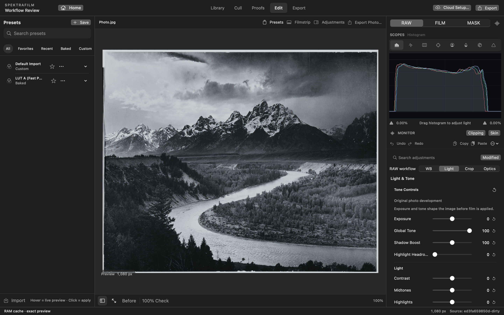
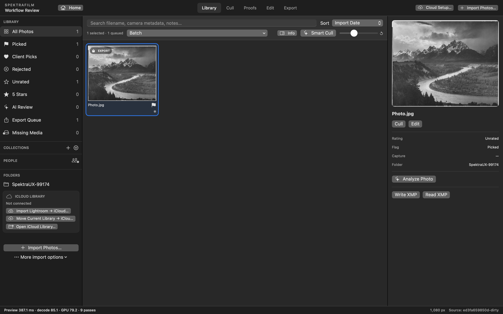
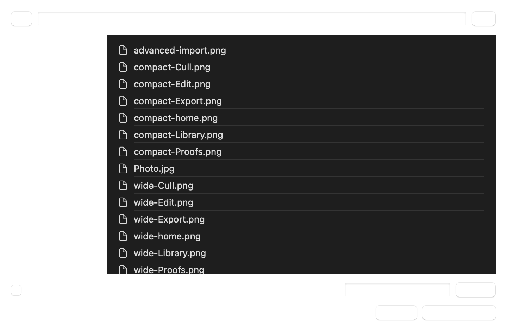
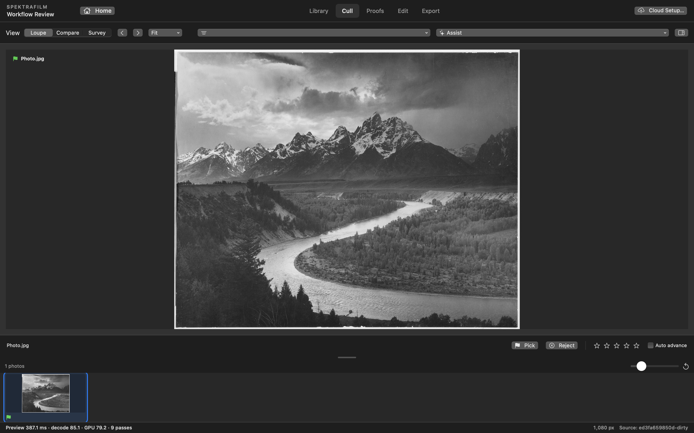
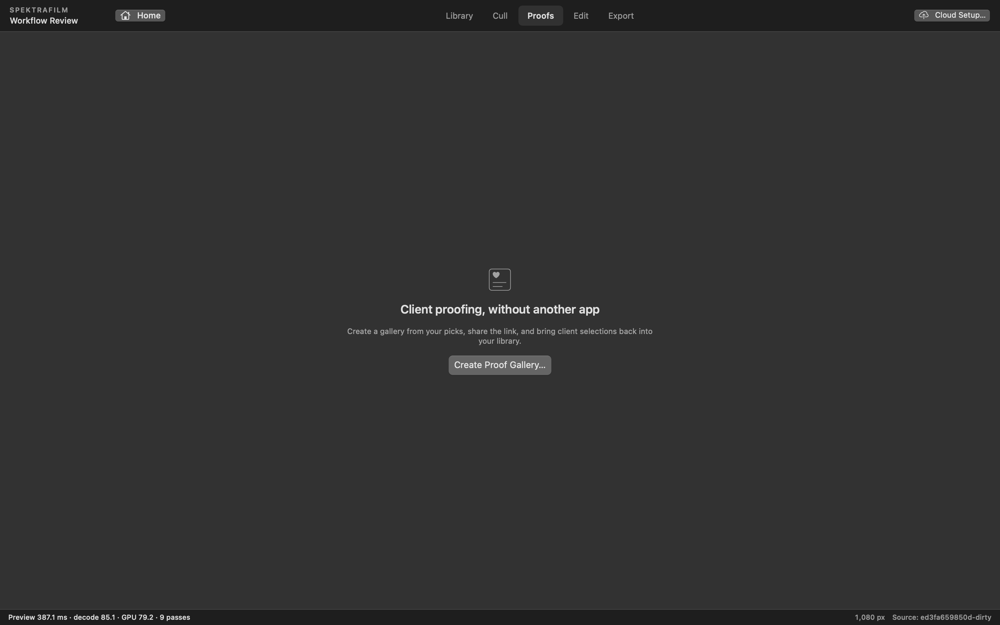
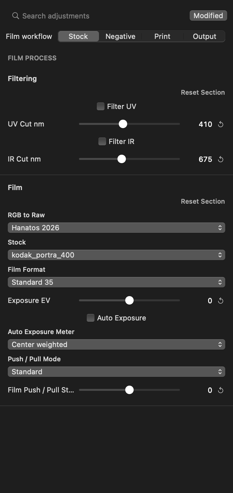
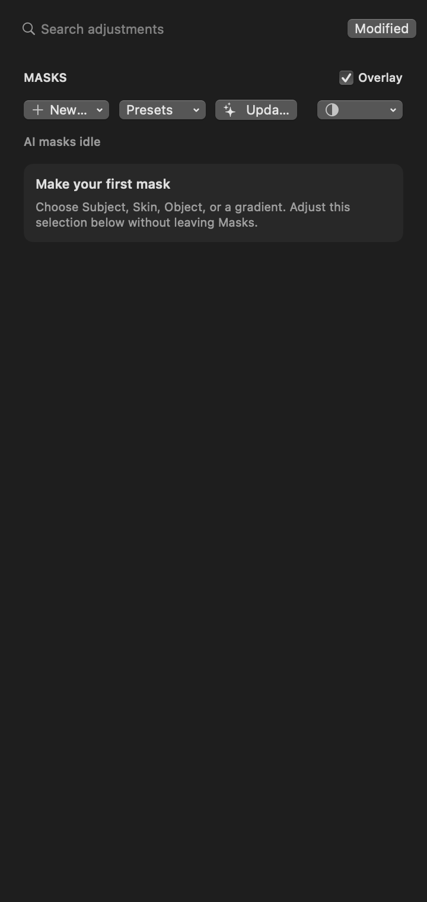
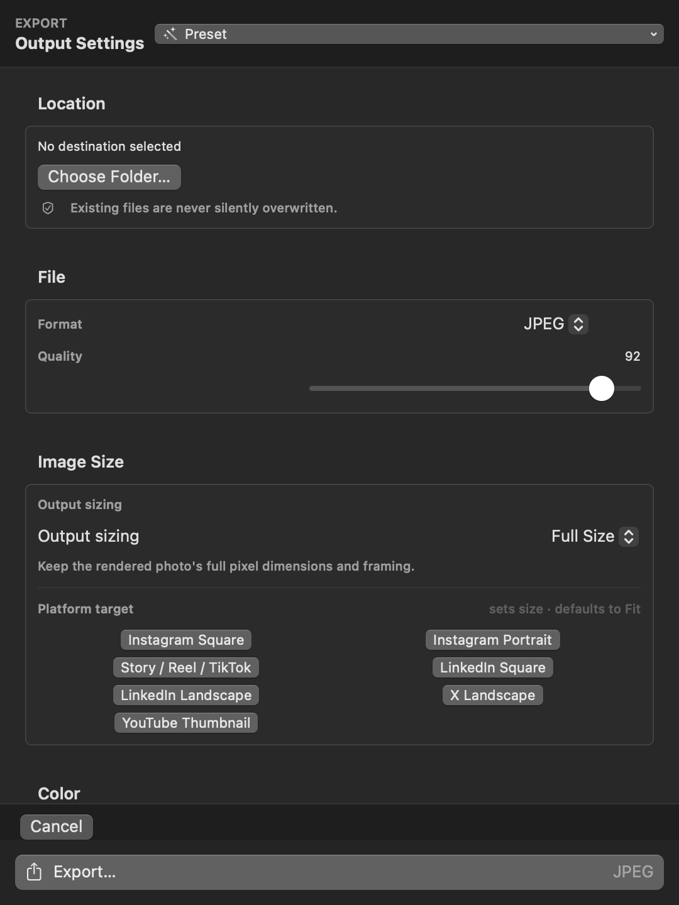

# SpektraFilm Studio

A native Mac photography workspace for **import → cull → develop → film → export**, with optional client proofs and local AI masks.

Built around [Andrea Volpato’s spektrafilm](https://github.com/andreavolpato/spektrafilm), Studio brings film stocks, negative development, print-paper response, grain, halation and optical character into a non-destructive photo workflow. It is a distinct community application, not spektrafilm’s official GUI. Photoshop remains a separate finishing step for detailed retouching.



**macOS 15+ · Intel x86_64 · version 0.6.8 · experimental.** The local build is ad-hoc signed. Developer ID notarization and live cloud-provider validation are separate release gates.

## Start with a photo

1. **Library → Import Photos** opens the file browser immediately. Import Folder/Card opens the folder browser. Optional verified backup, Lightroom Classic and cloud import options share one compact screen.
2. **Cull** reviews focus, exposure, face detail and near-duplicates. Pick/reject, ratings, client selections and the export queue are separate decisions. Suggestions never delete originals.
3. **Edit → RAW** sets camera white balance, exposure, tone, crop and optical character.
4. **Edit → FILM** selects the stock and shapes the negative, printing and scanning response. **MASK** applies supported adjustments to a selection.
5. **Export** chooses a destination once, then format, size and color settings. Review names and framing, then export. **Export This Photo** is also available from Edit.

Save work in any older running copy before quitting it and launching a newly built app.

## Library and import



Import files or folders directly, search and sort the library, organize albums, and manage ratings, labels and export selections. Reference mode leaves originals where they are. Verified ingest supports primary and backup destinations; optional cloud setup sits behind a disclosure rather than a sequence of pages. Recovery and relinking help with moved or unavailable media.



All project/photo/folder/save choices use one asynchronous in-app browser. It avoids the observed macOS open/save-service initialization crash and supports typed paths, drive navigation, hidden files, multiple selection, new folders and overwrite confirmation.

## Cull and client proofs



Use Single Photo, Compare or Overview to review a shoot. Background analysis provides explainable suggestions for focus, exposure, portraits and burst duplicates. Folder-specific Best Picks flags candidates while respecting rejected frames and preserving originals. Face groups are local similarity groups that can be reviewed and merged manually.



ProofDock builds galleries from selected photos, with optional passwords, selection limits and client favorites returned to the library. Local and internet links are distinct. Proofing is optional; you can go straight to Edit. Live internet hosting, SSH, Adobe, R2 and iCloud integrations require their own accounts and verification.

## RAW, FILM and MASK stay separate

The workflow tabs remain in place. RAW keeps White Balance, Light, Crop and Optics tabs. FILM keeps Stock, Negative, Print and Output tabs. The controls stay visible within the selected stage.

| Goal | Controls |
| --- | --- |
| Camera preparation | **RAW:** white balance, exposure, global tone and highlight headroom |
| Tone and framing | **RAW:** light, curve, crop/geometry and optical character |
| Film palette and negative response | **Film:** stock and photographic-process parameters |
| Printing and delivery character | **Film:** print, diffusion, scanning and color-density controls |
| Selective adjustments | **Masks:** subject, people, skin, object, brush and gradients |
| Exposure/color monitoring | Optional histogram, waveform, vectorscope, skin, clipping and False Color views |



The film look evaluates a photographic process rather than applying a single creative LUT. Internal reconstruction tables may still be used. Interactive proxies and caches keep editing responsive; final export uses the full-resolution path. Monitoring overlays are viewer aids and are excluded from normal exports.



**The AI providers and model versions follow [Redlamp](https://github.com/pdcgomes/redlamp).** Apple Vision supplies subject, background, people and face parts without downloads. Objects use SAM 2.1 Tiny (80 MB): hover to preview, click, box or brush to add, and hold Option to subtract. Depth uses embedded iPhone depth or Depth Anything 3 Mono Large (336 MB), with V2 Small (50 MB) as a smaller alternative. SAM 3 (988 MB) supplies landscape classes, hair, facial hair, body skin and clothing. Optional ViTMatte (109 MB) recovers additional strands. Install optional models in **Settings → Models**; model manifests verify exact sizes and SHA-256 hashes.

Masks are computed from the unedited photo and saved with their recipes. Update AI Masks, Refine Edges and the Refine Edge Brush preserve editable selections. Feather and Edge retain fine detail. Adaptive and saved mask presets create selections for each photo. Depth ranges and up to 16 mask components share one GPU evaluation pass. Histogram clipping indicators and five draggable tonal zones support exposure adjustments. Performance depends on the Mac and image size; no sub-millisecond claim is made.

Redlamp's MPL-2.0 mask source is adapted with attribution and its license included. Model licenses remain separate, including Meta's SAM License for SAM 3. Models prefer the GPU; Core ML can schedule unsupported operations on the CPU, but the app never retries with CPU-only execution. SAM2 uses the Intel UHD GPU on tested Radeon Pro 555X dual-GPU Macs because that Radeon produces invalid embeddings. Photos stay on the Mac.

## Export with one destination



Choose the output folder in **Destination**. The export button executes the job and stays disabled until photos and a destination are selected. Configure format, dimensions, crop/fit, color space and metadata; naming details remain available under advanced settings. Preflight names and review the queue. Existing destination files are protected, and interrupted jobs retain recovery information.

## Build locally

```bash
./PREPARE_STAGE3_AI_MODELS.command
./BUILD_ON_MAC.command
```

The output stays in `dist/SpektraFilmStudio.app` and `dist/SpektraFilmStudio-0.6.8-macOS-intel.zip`. Preparation downloads dependencies/models on first use. The native spectral core and generated curves are vendored. SAM files are cached, verified and compiled into the app; editing does not download them.

See [Build and validation](docs/BUILD.md) for requirements, signing and tests, and [Release procedure](docs/RELEASING.md) for publishing. Check `dist/build-info.txt` for the full source commit, architecture and signing provenance.

## Documentation and project layout

| Location | Purpose |
| --- | --- |
| [Workflow guide](docs/WORKFLOW.md) | Import, cull, develop, film, masks, proofs and export |
| [Audit and fixes](docs/AUDIT.md) | Reliability work, tested boundaries and integration limits |
| [Design and Redlamp study](docs/DESIGN.md) | Visual hierarchy, preserved tabs and model choice |
| [Picker repair](docs/PICKER_REPAIR.md) | Crash evidence and mixed-state-safe application |
| [Build pitfalls](docs/BUILD_PITFALLS.md) | Swift/concurrency regressions to avoid |
| [Development history](docs/DEVELOPMENT_HISTORY.md) | Consolidated earlier specifications and audit reports |
| [Implementation sources](IMPLEMENTATION_SOURCES.md) | Dependencies, provenance and model attribution |
| `Sources/`, `Native/`, `Rust/` | App, rendering and bridge source |
| `Resources/`, `Vendor/`, `THIRD_PARTY/` | Assets, prepared dependencies and licenses |
| `Tools/`, `scripts/` | Transfer tools, build, checks and repair application |
| `dist/` | Local app builds and ZIPs; retained locally and ignored by Git |

Root handoff/build-protocol files remain available for existing agent workflows. Earlier root-level reports are consolidated rather than lost. Screenshots are real native-app captures; see [image credits](docs/screenshots/CREDITS.md).

## Status, licenses and contributions

The repair and audit include Intel builds, source gates, native picker/project smoke tests, Metal rendering and soak checks, transfer-integrity tests, and real SAM/Vision inference. Detailed results and remaining limits belong in the validation report; passing static checks alone does not establish a notarized production release or validate every external provider.

Studio is developed openly with substantial AI-assisted iteration. Report reproducible problems with version/commit, camera/file type, steps and crash logs; omit private client photographs and credentials.

Studio source is GPL-3.0. Respect the original spektrafilm source and separate profile/data terms, [citation](https://github.com/andreavolpato/spektrafilm/blob/main/CITATION.cff), [NOTICE](NOTICE.md), dependency licenses and pretrained-weight licenses. SAM 2.1 Tiny’s Apache-2.0 license ships with its models. A project’s source-code license does not automatically license every model or dataset.

Film → Finish provides Redlamp’s actual procedural light leaks, dust, scratches, keyline, white-print, 35 mm rebate and slide-mount frames. Settings are saved with each edit and applied after cropping on the GPU.
